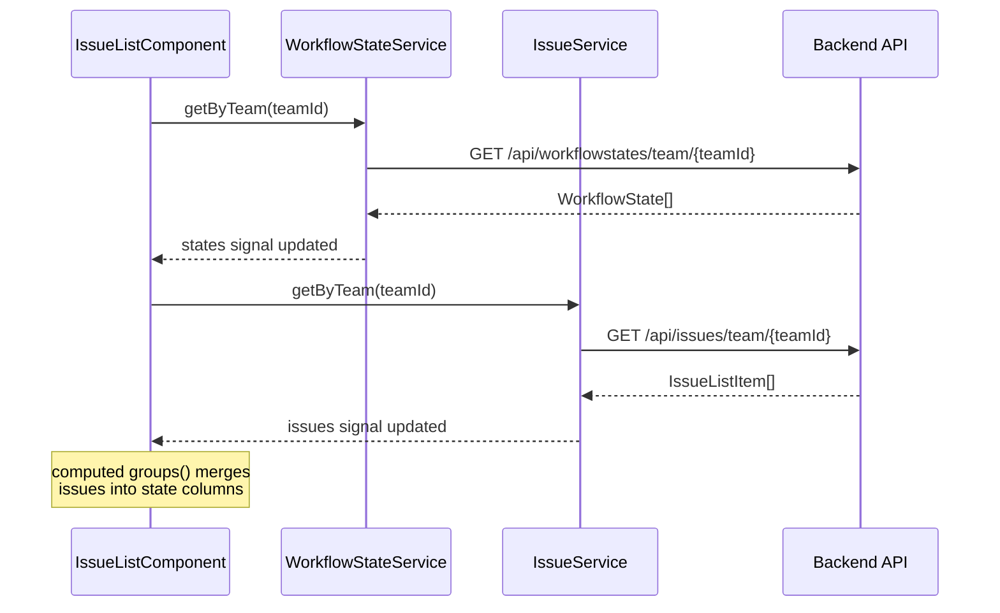
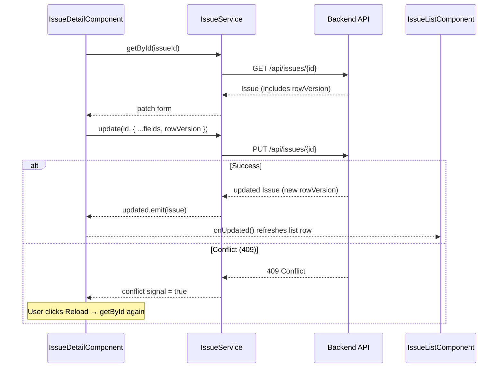

# Linear Clone — Frontend Architecture & Component Plan

This document describes the Angular frontend structure: what exists today, what still needs to be built, and how components, services, and models connect together. It mirrors the backend domain (`Team`, `WorkflowState`, `Issue`) and follows the phased roadmap in [`ROADMAP.md`](../ROADMAP.md).

---

## Table of contents

1. [High-level overview](#high-level-overview)
2. [Current directory structure](#current-directory-structure)
3. [Target directory structure](#target-directory-structure)
4. [Data models](#data-models)
5. [Services](#services)
6. [Components](#components)
7. [Routing plan](#routing-plan)
8. [How everything connects](#how-everything-connects)
9. [Backend API map](#backend-api-map)
10. [Development checklist by phase](#development-checklist-by-phase)

---

## High-level overview

Linear Clone is a project-management app organized around **teams**, **workflow states** (columns), and **issues** (work items). The frontend is a standalone-component Angular 21 app using:

- **Signals** (`signal`, `computed`, `effect`) for reactive state
- **Reactive forms** for create/edit flows
- **HttpClient** with a dev proxy (`/api/*` → backend)
- **Tailwind CSS** for styling (dark, Linear-inspired UI)

```
┌─────────────────────────────────────────────────────────────────┐
│                         App (shell)                              │
│  ┌──────────┐  ┌─────────────────────────────────────────────┐  │
│  │ Sidebar  │  │  Router outlet                               │  │
│  │ (future) │  │  ┌─────────────────────────────────────────┐ │  │
│  │          │  │  │ IssueList / Board / Settings / …        │ │  │
│  │          │  │  │  ├─ CreateIssueModal (overlay)          │ │  │
│  │          │  │  │  └─ IssueDetail (slide-over panel)      │ │  │
│  └──────────┘  │  └─────────────────────────────────────────┘ │  │
│                 └─────────────────────────────────────────────┘  │
└─────────────────────────────────────────────────────────────────┘
         │                              │
         ▼                              ▼
   TeamService (future)          IssueService ──────► /api/issues
   WorkflowStateService ────────► /api/workflowstates
```

---

## Current directory structure

What exists in the repo today:

```
frontend/src/
├── main.ts                          # Bootstrap (bootstrapApplication)
├── index.html
├── styles.scss                      # Global styles
├── tailwind.css                     # Tailwind v4 entry (@import "tailwindcss")
└── app/
    ├── app.ts                       # Root component — hosts <router-outlet>
    │                                #   (also has a leftover debug API call, see gaps)
    ├── app.html                     # <router-outlet />
    ├── app.scss                     # Root component styles
    ├── app.spec.ts                  # Root component test
    ├── app.config.ts                # Router + HttpClient providers
    ├── app.routes.ts                # Single route → IssueList
    │
    ├── models/
    │   ├── issue.model.ts           # ✅ Issue, IssueListItem, DTOs, IssuePriority
    │   └── workflow-state.model.ts  # ✅ WorkflowState, StateCategory
    │
    ├── services/
    │   ├── issue.service.ts         # ✅ CRUD against /api/issues
    │   └── workflow-state.service.ts # ✅ GET states by team
    │
    └── components/                   # Each component = .ts + .html + .scss + .spec.ts
        ├── issue-list/              # ✅ List view grouped by state
        ├── issue-detail/           # ✅ Slide-over edit panel
        └── create-issue-modal/     # ✅ Create issue modal
```

> **Stack note:** Angular 21 standalone components, RxJS 7.8, Tailwind CSS v4
> (via `@tailwindcss/postcss`), and Vitest for unit tests. There is no `app.module.ts`
> — the app bootstraps via `bootstrapApplication` in `main.ts` with `appConfig`.

---

## Target directory structure

Recommended layout as the app grows. Items marked **planned** do not exist yet.

```
frontend/src/app/
├── core/                            # Singletons, guards, interceptors (planned)
│   ├── auth/
│   │   ├── auth.service.ts
│   │   ├── auth.guard.ts
│   │   └── auth.interceptor.ts
│   └── api/
│       └── api-error.handler.ts
│
├── models/
│   ├── issue.model.ts               # ✅
│   ├── workflow-state.model.ts      # ✅
│   ├── team.model.ts                # planned
│   ├── user.model.ts                # planned (Phase 3)
│   ├── workspace.model.ts           # planned (Phase 3)
│   ├── comment.model.ts             # planned (Phase 4)
│   ├── activity-log.model.ts        # planned (Phase 4)
│   ├── label.model.ts               # planned (Phase 6)
│   └── cycle.model.ts               # planned (Phase 7)
│
├── services/
│   ├── issue.service.ts             # ✅
│   ├── workflow-state.service.ts    # ✅
│   ├── team.service.ts              # planned
│   ├── comment.service.ts           # planned
│   ├── activity.service.ts          # planned
│   ├── search.service.ts            # planned
│   ├── label.service.ts             # planned
│   ├── cycle.service.ts             # planned
│   └── realtime.service.ts          # planned (SignalR, Phase 5)
│
├── layout/                          # planned
│   ├── app-shell/
│   ├── sidebar/
│   └── top-bar/
│
├── components/
│   │── issues/                      # Issue domain (partially built)
│   │   ├── issue-list/              # ✅
│   │   ├── issue-detail/            # ✅
│   │   ├── create-issue-modal/      # ✅
│   │   ├── issue-board/             # planned (Phase 2)
│   │   ├── issue-card/              # planned (shared card for list/board)
│   │   ├── issue-row/               # planned (list row, extract from issue-list)
│   │   ├── priority-badge/          # planned (shared UI)
│   │   └── state-select/            # planned (shared dropdown)
│   │
│   ├── teams/                       # planned
│   │   └── team-switcher/
│   │
│   ├── auth/                        # planned (Phase 3)
│   │   ├── login/
│   │   └── register/
│   │
│   ├── comments/                    # planned (Phase 4)
│   │   ├── comment-list/
│   │   └── comment-form/
│   │
│   ├── activity/                    # planned (Phase 4)
│   │   └── activity-feed/
│   │
│   ├── search/                      # planned (Phase 6)
│   │   ├── filter-bar/
│   │   └── command-palette/
│   │
│   └── cycles/                      # planned (Phase 7)
│       └── cycle-view/
│
├── shared/                          # planned
│   ├── pipes/
│   ├── directives/
│   └── ui/                          # buttons, modals, confirm dialogs
│
├── app.ts
├── app.routes.ts
└── app.config.ts
```

---

## Data models

Models live in `src/app/models/` and mirror backend DTOs. Keep them in sync with `backend/src/Application/`.

### Implemented

| Model | File | Purpose |
|-------|------|---------|
| `IssuePriority` | `issue.model.ts` | Enum: NoPriority, Urgent, High, Medium, Low |
| `IssueListItem` | `issue.model.ts` | Lightweight projection for list/board cards |
| `Issue` | `issue.model.ts` | Full issue including `rowVersion` for optimistic concurrency |
| `CreateIssueRequest` | `issue.model.ts` | POST payload |
| `UpdateIssueRequest` | `issue.model.ts` | PUT payload (includes `rowVersion`) |
| `StateCategory` | `workflow-state.model.ts` | Enum: Backlog, Unstarted, Started, Completed, Canceled |
| `WorkflowState` | `workflow-state.model.ts` | A column/status on a team's board |

### Planned (by roadmap phase)

| Model | Phase | Fields (sketch) |
|-------|-------|-----------------|
| `Team` | 1 | `id`, `name`, `key`, `createdAt` |
| `Workspace` | 3 | `id`, `name`, `slug` |
| `User` | 3 | `id`, `email`, `displayName` |
| `Membership` | 3 | `userId`, `workspaceId`, `role` |
| `Comment` | 4 | `id`, `issueId`, `authorId`, `body`, `createdAt` |
| `ActivityLogEntry` | 4 | `id`, `issueId`, `actorId`, `changeType`, `oldValue`, `newValue`, `createdAt` |
| `Label` | 6 | `id`, `name`, `color`, `teamId` |
| `Cycle` | 7 | `id`, `teamId`, `name`, `startsAt`, `endsAt` |
| `ReorderIssueRequest` | 2 | `stateId`, `sortKey`, `rowVersion` |

---

## Services

Services are `@Injectable({ providedIn: 'root' })` and use `inject(HttpClient)`. All API calls use relative URLs (`/api/...`) proxied in dev via `proxy.conf.json`.

### Implemented

#### `IssueService` — `services/issue.service.ts`

| Method | HTTP | Used by |
|--------|------|---------|
| `getByTeam(teamId)` | `GET /api/issues/team/{teamId}` | `IssueListComponent` |
| `getById(id)` | `GET /api/issues/{id}` | `IssueDetailComponent` |
| `create(request)` | `POST /api/issues` | `CreateIssueModalComponent` |
| `update(id, request)` | `PUT /api/issues/{id}` | `IssueDetailComponent` |
| `delete(id)` | `DELETE /api/issues/{id}` | `IssueDetailComponent` |

#### `WorkflowStateService` — `services/workflow-state.service.ts`

| Method | HTTP | Used by |
|--------|------|---------|
| `getByTeam(teamId)` | `GET /api/workflowstates/team/{teamId}` | `IssueListComponent`, modals |

### Planned

| Service | Phase | Responsibility |
|---------|-------|----------------|
| `TeamService` | 1 | List teams, get current team context |
| `ReorderService` / extend `IssueService` | 2 | `reorder(id, { stateId, sortKey, rowVersion })` |
| `AuthService` | 3 | Login, register, token storage, logout |
| `CommentService` | 4 | List/create comments on an issue |
| `ActivityService` | 4 | Fetch activity log for an issue |
| `RealtimeService` | 5 | SignalR hub connection, push updates into signals |
| `SearchService` | 6 | Full-text search + composable filters |
| `LabelService` | 6 | CRUD labels, assign to issues |
| `CycleService` | 7 | List cycles, assign issues, cycle progress |

---

## Components

Legend: **✅ Built** · **🔧 Partial** · **📋 Planned**

### Layout & shell

| Component | Status | Responsibility | Parent / route |
|-----------|--------|----------------|----------------|
| `App` | ✅ | Root; hosts `<router-outlet>` | — |
| `AppShell` | 📋 | Sidebar + main content grid | Route wrapper |
| `Sidebar` | 📋 | Team nav, views (Issues, Board, Settings) | `AppShell` |
| `TopBar` | 📋 | Breadcrumb, search shortcut, user menu | `AppShell` |

### Issues (Phase 1–2)

| Component | Status | Responsibility | Inputs / outputs |
|-----------|--------|----------------|------------------|
| `IssueListComponent` | 🔧 | Fetches states + issues, groups by state, renders list | Uses hardcoded `teamId`; opens modals |
| `IssueDetailComponent` | ✅ | Slide-over panel: view/edit/delete issue | `@Input issueId, states` · `@Output updated, deleted, closed` |
| `CreateIssueModalComponent` | ✅ | Modal form to create an issue | `@Input teamId, states` · `@Output created, closed` |
| `IssueBoardComponent` | 📋 | Kanban board with drag-and-drop columns | `@Input teamId` · CDK drag-drop |
| `IssueCardComponent` | 📋 | Reusable card (identifier, title, priority dot, estimate) | `@Input issue` · `@Output selected` |
| `IssueRowComponent` | 📋 | Single row in list view (extract from `IssueListComponent`) | `@Input issue` · `@Output selected` |
| `PriorityBadgeComponent` | 📋 | Colored priority indicator | `@Input priority` |
| `StateSelectComponent` | 📋 | Shared state dropdown (used in create + detail) | `@Input states, value` · `@Output valueChange` |
| `ConfirmDialogComponent` | 📋 | Reusable delete confirmation | `@Input message` · `@Output confirmed, cancelled` |

**Known gaps in current build:**

- `IssueListComponent` does not wire `(click)` on rows to open `IssueDetailComponent`. The `<li>` has `cursor-pointer` styling but no click handler, so `selectedIssueId` is never set from the template — the detail panel is currently unreachable from the list.
- `showCreate` defaults to `signal(true)`, so the create modal opens on every page load. Should default to `false` and open via a "New issue" button.
- `teamId` is hardcoded in three places (`issue-list.component.ts`, `issue-list.component.html` line `[teamId]`, and `app.ts`); should come from `TeamService` or a route param.
- `App` root component (`app.ts`) contains a leftover debug `getByTeam(...).subscribe()` that just `console.log`s issues on startup. Remove it once teams/data loading is owned by feature components.
- List/detail/create components each re-fetch or hold their own `states`/`issues`; a shared store (signal-based service) would avoid duplication as the board view is added.

### Auth (Phase 3)

| Component | Status | Responsibility |
|-----------|--------|----------------|
| `LoginComponent` | 📋 | Email/password form, redirect after login |
| `RegisterComponent` | 📋 | Sign-up form |

### Collaboration (Phase 4)

| Component | Status | Responsibility |
|-----------|--------|----------------|
| `CommentListComponent` | 📋 | Thread of comments on issue detail |
| `CommentFormComponent` | 📋 | Add new comment |
| `ActivityFeedComponent` | 📋 | Chronological change history on issue detail |

### Search & filters (Phase 6)

| Component | Status | Responsibility |
|-----------|--------|----------------|
| `FilterBarComponent` | 📋 | Filter by state, priority, label, assignee |
| `CommandPaletteComponent` | 📋 | ⌘K quick search and navigation |

### Cycles (Phase 7)

| Component | Status | Responsibility |
|-----------|--------|----------------|
| `CycleViewComponent` | 📋 | Sprint board with progress rollup |

---

## Routing plan

### Current

```typescript
// app.routes.ts
{ path: '', component: IssueListComponent }
```

### Target

```typescript
// Phase 1 — issues under a team
{ path: '', redirectTo: 'team/:teamKey/issues', pathMatch: 'full' }
{ path: 'team/:teamKey/issues', component: IssueListComponent }
{ path: 'team/:teamKey/board', component: IssueBoardComponent }

// Phase 3 — auth
{ path: 'login', component: LoginComponent }
{ path: 'register', component: RegisterComponent }

// Phase 3 — guarded app shell
{
  path: '',
  component: AppShellComponent,
  canActivate: [authGuard],
  children: [ /* team routes */ ]
}
```

Issue detail and create flows can stay as **overlays** (not separate routes) initially, matching Linear's pattern. Later, deep-linking can use:

```
/team/ENG/issue/ENG-42
```

---

## How everything connects

### Component tree (current)

```
App
└── RouterOutlet
    └── IssueListComponent
        ├── (fetches via IssueService + WorkflowStateService)
        ├── CreateIssueModalComponent     [if showCreate]
        │   └── IssueService.create()
        └── IssueDetailComponent          [if selectedIssueId]
            └── IssueService.getById() / update() / delete()
```

### Component tree (target — Phase 2+)

```
App
└── AppShellComponent
    ├── SidebarComponent
    │   └── TeamSwitcherComponent ──► TeamService
    ├── TopBarComponent
    │   └── CommandPaletteComponent ──► SearchService
    └── RouterOutlet
        ├── IssueListComponent ──► IssueService, WorkflowStateService
        │   ├── IssueRowComponent (×N)
        │   ├── CreateIssueModalComponent
        │   └── IssueDetailComponent
        │       ├── CommentListComponent ──► CommentService
        │       └── ActivityFeedComponent ──► ActivityService
        │
        └── IssueBoardComponent ──► IssueService, WorkflowStateService
            ├── BoardColumnComponent (× states)
            │   └── IssueCardComponent (×N, CDK drag-drop)
            ├── CreateIssueModalComponent
            └── IssueDetailComponent
```

### Data flow: load issue list



### Data flow: edit issue (optimistic concurrency)



### State ownership

| State | Owner | Consumers |
|-------|-------|-----------|
| `issues: IssueListItem[]` | `IssueListComponent` (or future shared store) | List rows, board cards |
| `states: WorkflowState[]` | `IssueListComponent` / `IssueBoardComponent` | Grouping, dropdowns |
| `selectedIssueId` | Parent list/board component | Opens `IssueDetailComponent` |
| `issue: Issue` (full) | `IssueDetailComponent` | Edit form, rowVersion |
| `teamId` | Route param or `TeamService` | All team-scoped API calls |

For Phase 5 (real-time), `RealtimeService` will patch the parent's `issues` signal when another client creates/updates/deletes an issue.

---

## Backend API map

Endpoints the frontend consumes today and planned additions.

| Endpoint | Status | Frontend consumer |
|----------|--------|-------------------|
| `GET /api/issues/team/{teamId}` | ✅ | `IssueService.getByTeam` |
| `GET /api/issues/{id}` | ✅ | `IssueService.getById` |
| `POST /api/issues` | ✅ | `IssueService.create` |
| `PUT /api/issues/{id}` | ✅ | `IssueService.update` |
| `DELETE /api/issues/{id}` | ✅ | `IssueService.delete` |
| `GET /api/workflowstates/team/{teamId}` | ✅ | `WorkflowStateService.getByTeam` |
| `GET /api/teams` | 📋 | `TeamService.list` |
| `PATCH /api/issues/{id}/reorder` | 📋 | Board drag-drop |
| `POST /api/auth/login` | 📋 | `AuthService` |
| `GET /api/issues/{id}/comments` | 📋 | `CommentService` |
| `GET /api/issues/{id}/activity` | 📋 | `ActivityService` |
| `GET /api/search?q=` | 📋 | `SearchService` |
| SignalR hub `/hubs/workspace` | 📋 | `RealtimeService` |

**Dev proxy:** `frontend/proxy.conf.json` forwards `/api` to the backend at `http://localhost:5109` (`secure: false`, `changeOrigin: true`). Update the `target` if your backend listens elsewhere.

**Seeded team (local dev):** The ENG team GUID used in code is `5a6fcfcf-d1b9-4398-9ae3-738d7c3db021` — replace with dynamic team resolution once `TeamService` exists.

---

## Development checklist by phase

Use this as a build order. Check off items as you complete them.

### Phase 1 — Core (in progress)

**Models & services**

- [x] `issue.model.ts`
- [x] `workflow-state.model.ts`
- [x] `IssueService`
- [x] `WorkflowStateService`
- [ ] `team.model.ts` + `TeamService`

**Components**

- [x] `IssueListComponent` — grouped list view
- [x] `IssueDetailComponent` — edit slide-over with 409 handling
- [x] `CreateIssueModalComponent`
- [ ] Wire list row click → `selectedIssueId`
- [ ] Fix create modal default (`showCreate = false`; open via button)
- [ ] Remove leftover debug `getByTeam` console.log in `app.ts`
- [ ] `ConfirmDialogComponent` before delete
- [ ] Extract `IssueRowComponent`, `PriorityBadgeComponent`, `StateSelectComponent`
- [ ] `AppShellComponent` + basic `SidebarComponent`

### Phase 2 — Board + ordering

- [ ] `IssueBoardComponent` with `@angular/cdk/drag-drop`
- [ ] `IssueCardComponent`
- [ ] `BoardColumnComponent`
- [ ] Extend `IssueService` with reorder endpoint
- [ ] Optimistic UI: patch local `issues` signal on drag, rollback on error

### Phase 3 — Auth & multi-tenancy

- [ ] Auth models + `AuthService` + interceptor + guard
- [ ] `LoginComponent`, `RegisterComponent`
- [ ] Workspace-scoped API calls
- [ ] Protect routes with `authGuard`

### Phase 4 — Activity & comments

- [ ] Comment + activity models and services
- [ ] Embed `CommentListComponent` + `ActivityFeedComponent` in `IssueDetailComponent`

### Phase 5 — Real-time

- [ ] `RealtimeService` (SignalR)
- [ ] Subscribe in list/board parents; merge remote events into signals

### Phase 6 — Search & filtering

- [ ] `FilterBarComponent`, `CommandPaletteComponent`
- [ ] Label model, service, and UI chips on cards

### Phase 7 — Cycles

- [ ] `CycleViewComponent` + `CycleService`
- [ ] Cycle selector on issue create/detail

---

## Quick reference: file → responsibility

| File | Role |
|------|------|
| `app.config.ts` | Registers router, HTTP client, future interceptors |
| `app.routes.ts` | URL → component mapping |
| `models/issue.model.ts` | Issue types shared across all issue UI |
| `models/workflow-state.model.ts` | Column/status types for grouping and selects |
| `services/issue.service.ts` | All issue HTTP operations |
| `services/workflow-state.service.ts` | Load workflow columns for a team |
| `components/issue-list/*` | Main view: fetch, group, display, orchestrate modals |
| `components/issue-detail/*` | Single-issue CRUD with concurrency |
| `components/create-issue-modal/*` | Create flow |

---

## Related docs

- [`../ROADMAP.md`](../ROADMAP.md) — full-stack phased plan (backend + frontend)
- [`../README.md`](../README.md) — stack overview and Docker commands
- Backend entities: `backend/src/Domain/Entities/`
- Backend DTOs: `backend/src/Application/Issues/IssueDTOs.cs`
